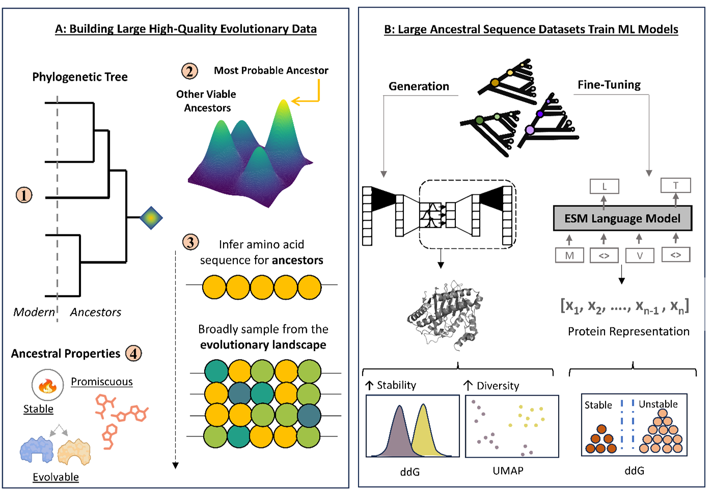

# EvoSeq-ML: Enhancing Protein Engineering with Evolutionary Data

Welcome to the EvoSeq-ML project! 🎉 This project leverages ancestral sequence reconstruction (ASR) to enhance machine learning models for protein engineering. Our approach aims to improve protein sequence generation and fine-tuning using rich evolutionary data.

## Table of Contents
- [Introduction](#introduction)
- [Preprocessing and Ancestral Sequence Reconstruction](#preprocessing-and-ancestral-sequence-reconstruction)
- [Usage](#usage)
- [Citation](#citation)

## Introduction

In protein engineering, advancements in machine learning (ML) have led to significant progress, such as predicting protein structures and generating novel proteins. However, the importance of high-quality data curation is often overlooked. EvoSeq-ML integrates ASR into ML models, providing diverse and stable sequences with rich evolutionary information. This approach enhances ML model performance in tasks related to protein sequence generation and fitness prediction.

- **Generative Models:**
    - We use Variational Autoencoders (VAEs) to generate novel protein sequences.
    - The training data includes ancestral sequences reconstructed through ASR, ensuring high-quality and diverse inputs.
- **Language Model Fine-Tuning:**
    - We fine-tune the ESM protein language model with ancestral data to create evolutionary-driven protein representations.
    - These fine-tuned models are used for downstream tasks like stability prediction.
- **Performance:**
    - Our evolutionary-driven representations have shown improved performance in protein classification tasks, demonstrating the effectiveness of integrating ASR data.
    - Generated sequences are evaluated for structural stability, sequence variability, and semantic diversity using tools like AlphaFold and FoldX.

## Preprocessing and Ancestral Sequence Reconstruction

1. **Building Evolutionary Data:**
    - We start by constructing phylogenetic trees to infer ancient protein sequences from modern descendants.
    - ASR offers deeper insights into protein evolution, capturing mutation rates, phylogenic relationships, and evolutionary trajectories.

2. **Ancestral Sequence Inference:**
    - Using both Bayesian inference and maximum likelihood methods, we generate ensembles of ancestral sequences.
    - These sequences provide a robust dataset that reflects the complexity and diversity of biological systems.

3. **Key Benefits:**
    - Ancestral sequences are often more stable, promiscuous, and evolvable, making them ideal for training ML models.

#### ASR tools used in this work include [AP-LASR](https://github.com/WoldringLabMSU/AP-LASR) and [BAli--Phy](https://www.bali-phy.org/).

> Reference: Redelings BD BAli-Phy version 3: model-based co-estimation of alignment and phylogeny. (2021) Bioinformatics 37(18). doi:10.1093/bioinformatics/btab129.

## Usage
- Training script: `Generative Model/oh_vae_train.py`
    - Expects input file `cleaned-aligned-sampled.fasta` to be present in the wokring directory (same directory as the script).
    - Outputs saved model checkpoints as `Bali_vae_oh_latent100_16_1CNN_{lowest-val-loss}.pth` in the working directory.
- Finetuning script: `Fine-Tuning/fine-tune.py`
    - Expects input fasta file which may be modified in line 96, which currently shows example usage with `Lysozyme.fasta`.
    - Outputs fine-tuned model to working directory. The nomenclature for saved models may be edited in line 92.
- Generation script: `Generative Model/oh_vae_generate_from_training.py`
    - Modify the `model_path` variable in line 50 to the desired model checkpoint path.
    - Outputs sequences to a csv with default name `generated_pk2_Bali_16_1CNN_improved.csv`. This may be edited in line 54 of the script.

## Citation
Please cite our [preprint](https://www.biorxiv.org/content/10.1101/2024.10.02.616302v1)! Official peer-reviewed publication coming soon.

> Mardikoraem, M., Pascual, N., Finneran, P., & Woldring, D. (2024). EvoSeq-ML: Advancing Data-Centric Machine Learning with Evolutionary-Informed Protein Sequence Representation and Generation. bioRxiv, 2024-10.
